# Actividad en clase - Calculator

## 1. Instalación de dependencias
Para instalar las dependencias necesarias, ejecutar el siguiente comando en la terminal:

```
npm install
```

comandos usados:
``` 
npm init -y
```
```
npm install fastify
```
```
npm install -D typescript @types/node ts-node nodemon 
```
```
npx tsc --init
```
```
npm install @fastify/swagger 
```
```
npm install @fastify/swagger-ui
```

## Estructura del proyecto

PE 2.2 CALCULATOR/
├── node_modules/        
├── src/
│   ├── routes/           
│   │   ├── calculator.routes.ts  
│   │   └── index.ts              
│   └── tools/            
│       └── calculator.tools.json 
├── package.json          
└── tsconfig.json

## 2. creamos la carpeta src, y dentro de ella la carpeta routes

## 3. Creamos el archivo index.ts dentro de la carpeta src
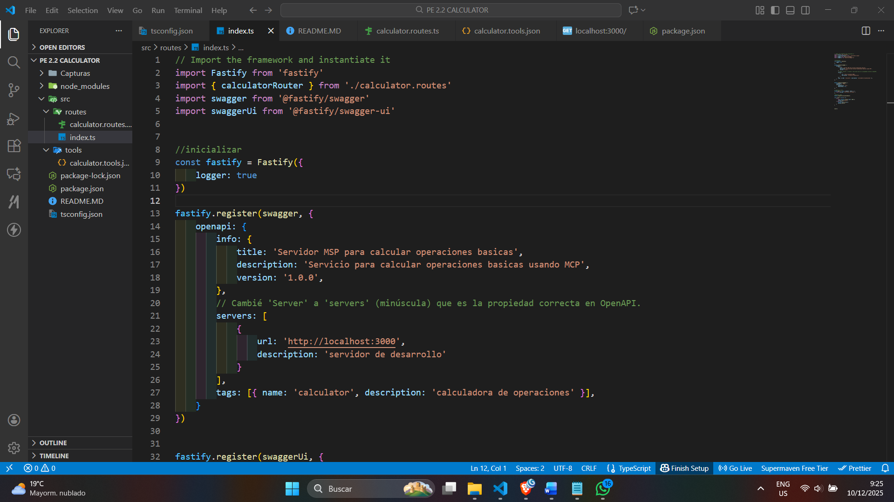

aqui estaran el codigo que se va a usar para el servidor, y para la ruta. 

## 4. Creamos el archivo calculator.routes.ts dentro de la carpeta src/routes

aqui estaran los codigos que se va a usar para la ruta. en el estaran la logica de lo que vamos a hacer, en este caso la calculadora, toda su logica estara en esta ruta. Tambien estara el codigo para el schema que se usara para validar los datos que se enviaran a la ruta. y el fastify.post que se usara para enviar los datos a la ruta.

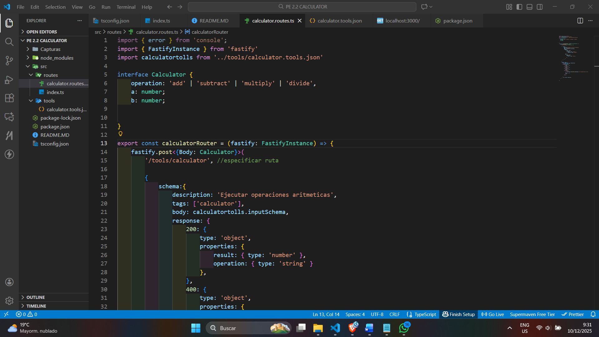

## 5. Probamos el servidor usando thunder. 

aqui validamos que todo funciona correctamente. y que se nos devuelve una respuesta correcta.

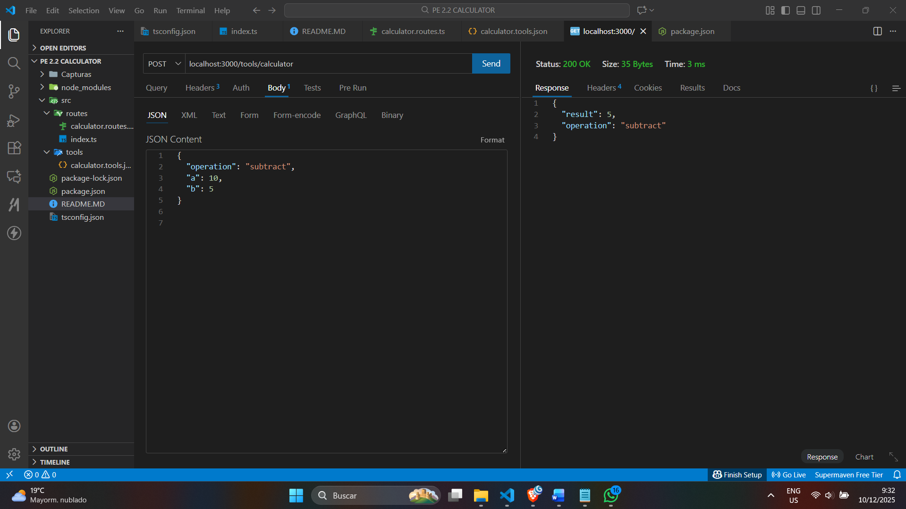

debemos hacer comprobacion con todas las operaciones posibles, y que se nos devuelve la respuesta correcta.

## 6. Creamos el archivo calculator.tools.json dentro de la carpeta src/tools

aqui estara la definicion en formato json del schema que se usara para validar los datos que se enviaran a la ruta.

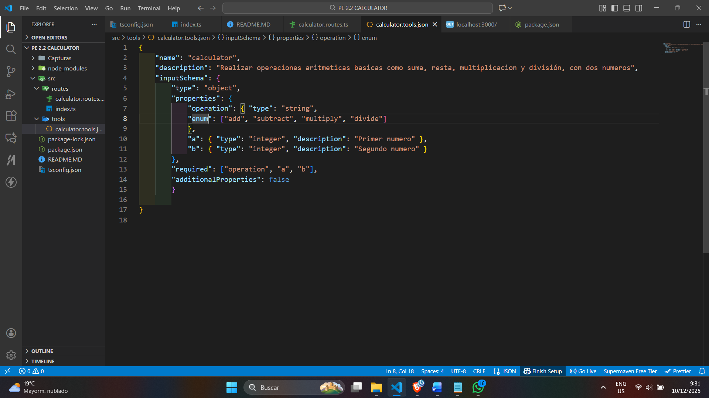

## 7. Revisar la configuracion del index.ts

Aqui deben estar las rutas, pero se agregara swagger y swagger-ui para que se pueda ver la documentacion de la ruta, y que se pueda acceder a la documentacion de la ruta desde la url localhost:3000/docs

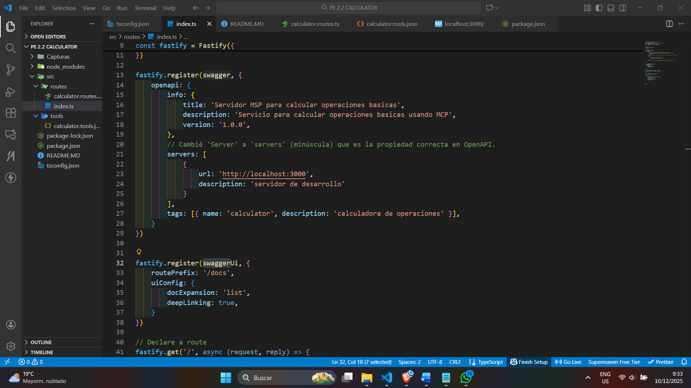

## 8. Iniciar el servidor

Iremos a la url localhost:3000/docs y vera la documentacion de la ruta y probaremos 


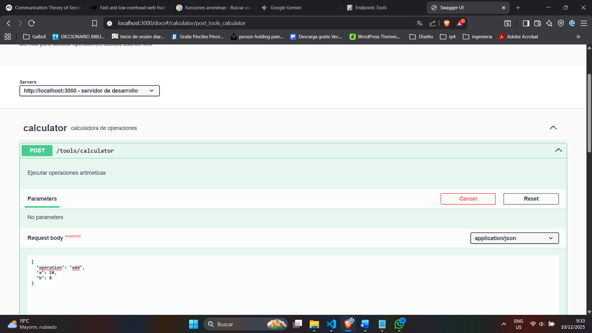
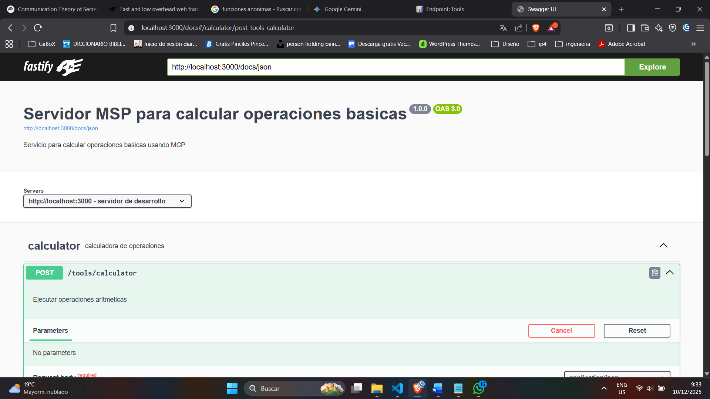


### Documentación OpenAPI refinada 

# MCP Calculator Server API - v1.0.0

Servidor MCP (Model Context Protocol) para realizar operaciones aritméticas básicas con documentación OpenAPI completa, ejemplos detallados y esquemas de seguridad.

##  Características

- **Operaciones Aritméticas**: Suma, resta, multiplicación y división
- **Documentación OpenAPI 3.0**: Especificación completa con Swagger UI
- **Validación Estricta**: JSON Schema validation con mensajes de error claros
- **Esquemas de Seguridad**: Documentación de API Key, Bearer Token y OAuth2
- **Ejemplos Completos**: Request/response examples para todos los casos
- **Alta Performance**: Construido con Fastify
- **Health Checks**: Endpoints de monitoreo
- **Mitigación Tool Poisoning**: Validación y sanitización de inputs

## 📦 Requisitos

- **Node.js**: >= 18.0.0
- **npm**: >= 9.0.0
- **TypeScript**: 5.9+

## Instalación

### 1. Clonar el repositorio

```bash
git clone https://github.com/your-username/pe-2.2-calculator.git
cd pe-2.2-calculator
```

### 2. Instalar dependencias

```bash
npm install
```

### 3. Compilar TypeScript (opcional)

```bash
npx tsc
```

## Uso

### Modo Desarrollo (con hot-reload)

```bash
npm run dev
```

El servidor se iniciará en `http://localhost:3000`

### Acceder a la Documentación

Una vez iniciado el servidor, accede a:

- **Swagger UI**: http://localhost:3000/docs
- **Health Check**: http://localhost:3000/
- **API Endpoint**: http://localhost:3000/tools/calculator

## 📚 Documentación API

## Operaciones Soportadas

### POST /tools/calculator

Realiza operaciones aritméticas entre dos números.

#### Request Body

```json
{
  "operation": "add|subtract|multiply|divide",
  "a": number,
  "b": number
}
```

#### Operaciones Disponibles

| Operación | Descripción | Ejemplo |
|-----------|-------------|---------|
| `add` | Suma dos números | `10 + 5 = 15` |
| `subtract` | Resta dos números | `20 - 8 = 12` |
| `multiply` | Multiplica dos números | `7 * 6 = 42` |
| `divide` | Divide dos números | `100 / 4 = 25` |

#### Respuestas

**200 OK - Éxito**
```json
{
  "result": 15,
  "operation": "add"
}
```

**400 Bad Request - Error**
```json
{
  "message": "No se puede dividir por 0",
  "error": "Bad Request",
  "statusCode": 400
}
```

**500 Internal Server Error**
```json
{
  "message": "Error inesperado al procesar la operación",
  "error": "Internal Server Error",
  "statusCode": 500
}
```

## Seguridad

### Esquemas de Seguridad Documentados

La API documenta tres esquemas de autenticación para futuras implementaciones:

#### 1. API Key Authentication

```bash
curl -H "X-API-Key: tu-api-key-aqui" \
     -X POST http://localhost:3000/tools/calculator \
     -H "Content-Type: application/json" \
     -d '{"operation": "add", "a": 5, "b": 3}'
```

#### 2. Bearer Token (JWT)

```bash
curl -H "Authorization: Bearer eyJhbGc..." \
     -X POST http://localhost:3000/tools/calculator \
     -H "Content-Type: application/json" \
     -d '{"operation": "multiply", "a": 7, "b": 6}'
```

#### 3. OAuth 2.0

- **Flujos**: Authorization Code, Client Credentials
- **Scopes**: 
  - `calculator:read` - Realizar operaciones
  - `calculator:admin` - Acceso administrativo

### Mitigación de Tool Poisoning

El servidor implementa las siguientes medidas:

✅ **Validación estricta** de esquemas JSON  
✅ **Sanitización** de todos los inputs  
✅ **Límites** en valores numéricos  
✅ **Logging** completo para auditoría  
✅ **Rate limiting** (a implementar en producción)

> **Nota**: En la versión actual (v1.0.0), no se requiere autenticación. Los esquemas están documentados para futuras versiones.

## 🔄 Evolución del API

### Roadmap

#### v1.0.1 (Actual)
- Operaciones básicas: +, -, *, /
- Validación de entrada
- Manejo de errores
- Documentación completa

#### v1.1.0 (Q1 2025) - Non-Breaking
- Nuevas operaciones: power, sqrt, modulo
- Parámetro opcional `precision`
- Metadata en respuestas

#### v2.0.0 (Q3 2025) - Breaking
- Expresiones matemáticas completas
- Nueva estructura de respuesta
- Autenticación requerida

### Breaking vs Non-Breaking Changes

#### Non-Breaking (compatible)
- Agregar nuevos endpoints
- Agregar campos opcionales
- Nuevas operaciones
- Mejoras de performance

#### Breaking (incompatible)
- Cambiar tipos de campos
- Remover campos existentes
- Cambiar nombres de campos
- Modificar validaciones existentes


## 💡 Ejemplos de Uso

### Suma

```bash
curl -X POST http://localhost:3000/tools/calculator \
  -H "Content-Type: application/json" \
  -d '{
    "operation": "add",
    "a": 10,
    "b": 5
  }'

# Respuesta: {"result": 15, "operation": "add"}
```

### División

```bash
curl -X POST http://localhost:3000/tools/calculator \
  -H "Content-Type: application/json" \
  -d '{
    "operation": "divide",
    "a": 100,
    "b": 4
  }'

# Respuesta: {"result": 25, "operation": "divide"}
```

### Error: División por Cero

```bash
curl -X POST http://localhost:3000/tools/calculator \
  -H "Content-Type: application/json" \
  -d '{
    "operation": "divide",
    "a": 10,
    "b": 0
  }'

# Respuesta: 
# {
#   "message": "No se puede dividir por 0",
#   "error": "Bad Request",
#   "statusCode": 400
# }
```

## 🛠️ Desarrollo

### Estructura del Proyecto

```
pe-2.2-calculator/
├── src/
│   ├── routes/
│   │   ├── calculator.routes.ts    # Lógica de calculadora
│   │   └── index.ts                 # Configuración servidor
│   └── tools/
│       └── calculator.tools.json    # Schema de validación
├── package.json
├── tsconfig.json
├── README.md
└── CHANGELOG.md                     # Historial de cambios
```

### Scripts Disponibles

```bash
# Desarrollo con hot-reload
npm run dev

# Tests (a implementar)
npm test
```

### Tecnologías Utilizadas

- **Fastify** 5.6: Framework web de alto rendimiento
- **TypeScript** 5.9: Tipado estático
- **@fastify/swagger**: Generación OpenAPI
- **@fastify/swagger-ui**: Interfaz Swagger UI
- **Nodemon**: Hot-reload en desarrollo
- **ts-node**: Ejecución TypeScript


### Capturas de pantalla

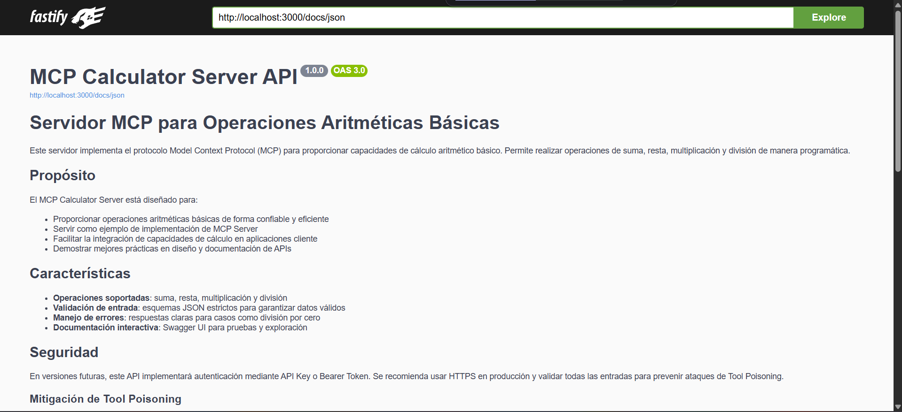

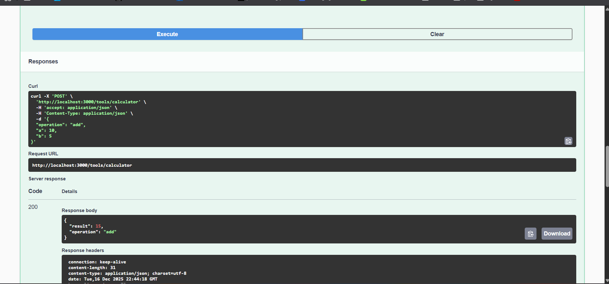
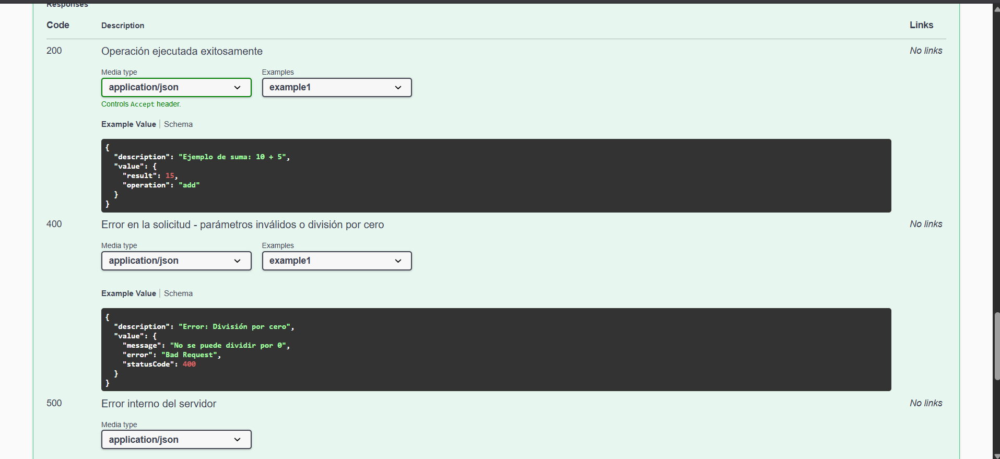
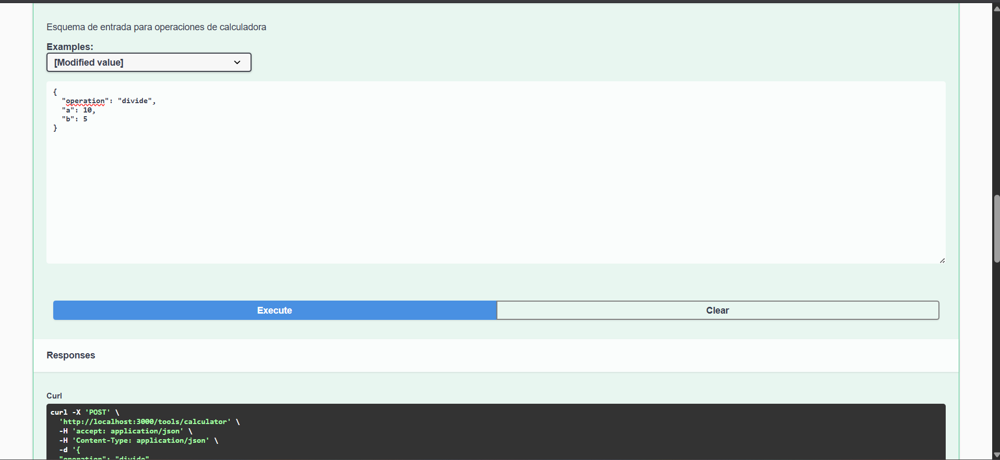

